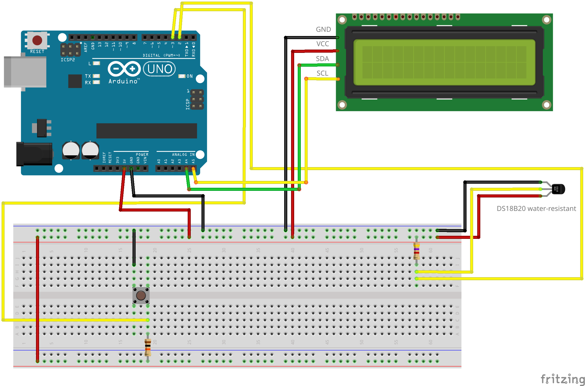

# Термометр-логгер на Arduino Uno

## Описание:
Автономное устройство на базе Arduino Uno, которое измеряет температуру с помощью датчика DS18B20, выводит данные на LCD 1602, индицирует состояние светодиодом и позволяет переключать режимы отображения кнопкой. Сохраняет максимум и минимум температуры за всё время работы.

---

## Фото

---

## Схема подключения:

---

## Компоненты:
- Piranha Uno R3 (аналог Arduino Uno R3);
- Цифровой датчик температуры DS18B20 (влагозащищенный);
- LCD дисплей 1602 с I2C модулем;
- Тактовая кнопка;
- Резисторы:
  - 10 кОм  --- 1 шт.
  - 4,7 кОм --- 1 шт.
- Макетная плата и провода.

---

## Реализовано:
- Прерывания для мгновенной реакции на кнопку;
- Неблокирующий опрос датчика.

---

## Изучено:
- Работа с датчиком по протоколу 1-Wire;
- Использование I2C для подключения LCD;
- Неблокирующие таймеры;
- Аппаратное и программное подавление дребезга кнопки;
- Использование прерываний.

---

## Благодарности:

Этот проект был бы невозможен без замечательных библиотек с открытым исходным кодом:
- **OneWire** — [Paul Stoffregen](https://github.com/PaulStoffregen/OneWire) (основано на оригинальной работе [Jim Studt](https://github.com/jimstudt))
- **DallasTemperature** — [Miles Burton](https://github.com/milesburton/Arduino-Temperature-Control-Library)

## Контакты

Email: eremik5535@gmail.com
